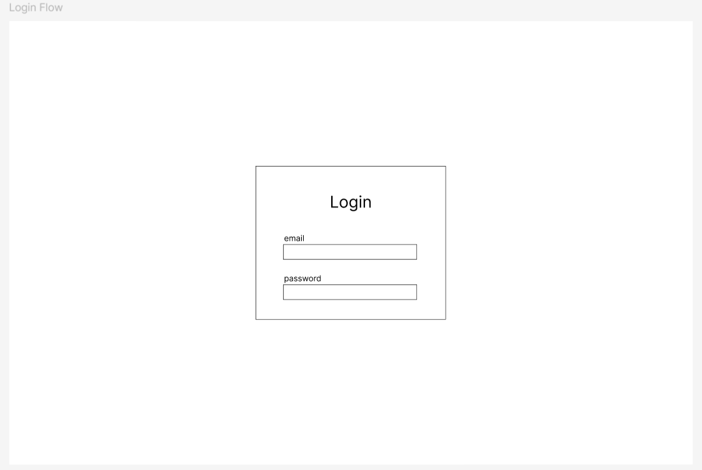
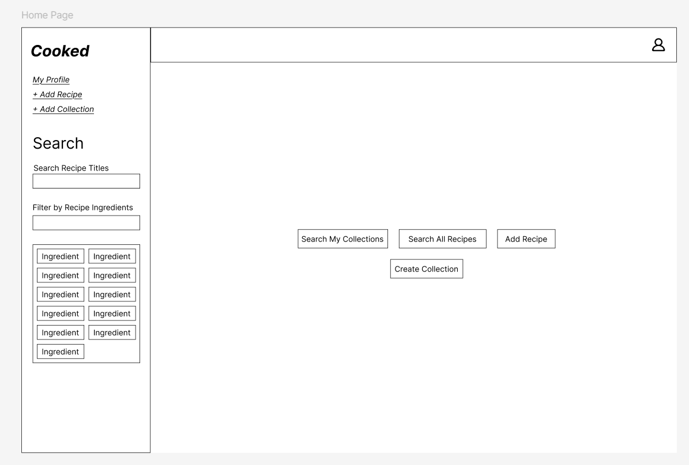
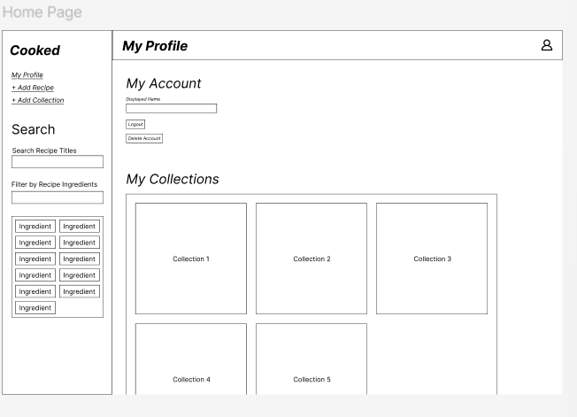
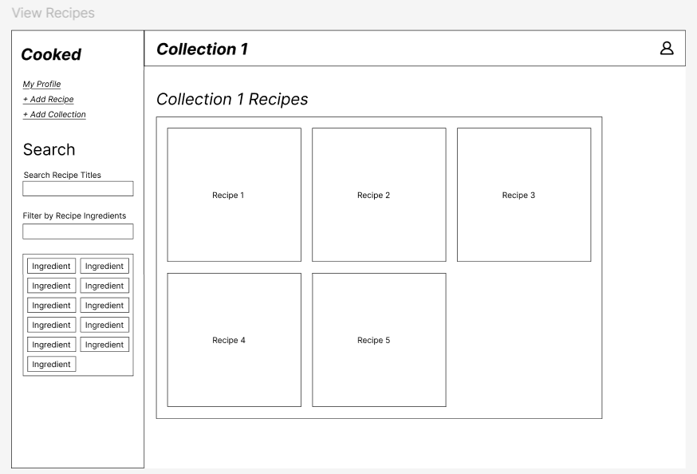
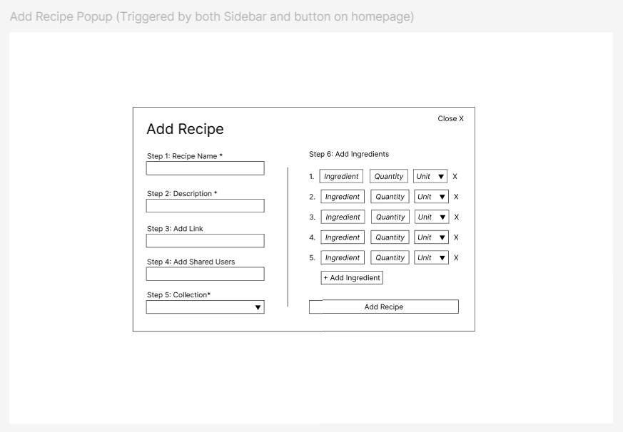

# UI Sketches

## Log in popup

- This is a sketch of what the login popup will look like. It will likely additionally contain a "submit" button, as well as a button/link that says something along the lines of "don't have an account? Sign up ->"
- The sign up popup will look basically identical to this, but with a confirm password field.
- After signing in, users will be taken to the homepage. 
## Home Page

- Once the user is signed in, they're redirected to the home page. From here, they can navigate to the app's other pages
- Users can also navigate to their profile page by clicking the user icon in the top right corner

## Profile Page

- (the figma group is incorrectly labeled as "home page", but the H1 heading on the sketch does correctly label the page as the profile page )
- From the profile page, the user can change their username, log out, or delete their account
- Users can also view their collections on their profile page. 

## Collection Page

- When users select a collection, they can see the recipes inside of the collection. 
- There will also likely be a back button and some options to change the collection settings/membership, and a plus button in the bottom right corner to add a recipe to the collection.

## Recipe Page 

- This is the sketch for viewing a recipe, specifically an imported recipe. In addition to displaying the static info, users can edit the contents depending on whether or not they are the creator. 

## Add recipe popup

- This is the page for adding a new recipe
- It has required fields for necessary recipe info, and optional fields for an external link and shared users.
## Create Collection Popup

- This is the page for creating a new collection
- Shared Users are the users that are in the collection
- Users will be able to edit this information after creating the collection